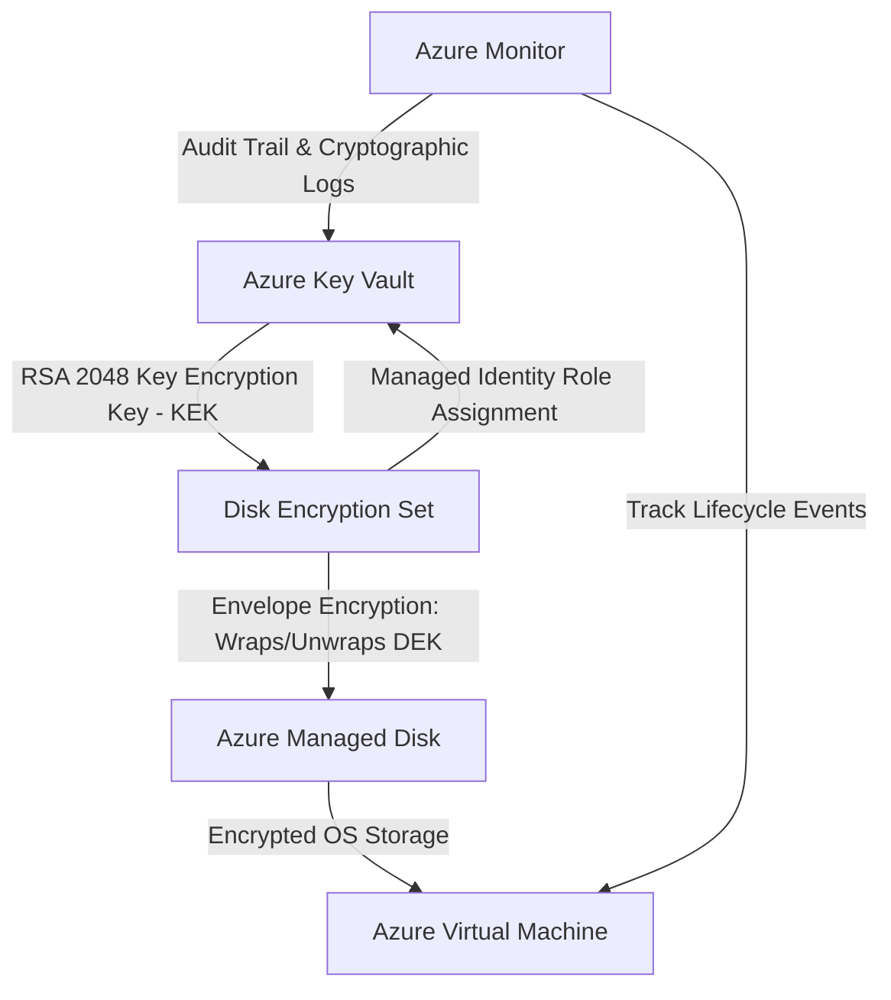

# Azure Disk Encryption with Customer-Managed Keys (CMK)


A production-grade cloud security project demonstrating Server-Side Encryption (SSE) of Azure Virtual Machine Managed Disks using Customer-Managed Keys (CMK) stored in Azure Key Vault via Disk Encryption Sets (DES).

---

## 1. Problem Statement

> **"Securing Azure VM disks requires customer managed encryption keys to prevent unauthorized access, breaches, and data loss."**

Traditional cloud storage relies on Microsoft-managed platform keys. While convenient, organizations with stringent compliance mandates require complete cryptographic sovereignty. Additionally, Microsoft has scheduled the legacy **Azure Disk Encryption (ADE)** feature for retirement on **September 15, 2028**. This project implements the modern, cloud-native standard: Server-Side Encryption with Customer-Managed Keys (SSE with CMK).

---

## 2. Abstract

Azure Disk Encryption and Customer-Managed Keys is a cloud security project that demonstrates how to protect Azure Virtual Machine disks using a Customer-Managed Key (CMK) stored in Azure Key Vault. The project uses a Disk Encryption Set (DES) to connect the customer-managed key with Azure Managed Disks and encrypt the VM's operating-system and data disks.

The project also demonstrates key rotation, access control, monitoring, and key lifecycle management. It highlights the importance of protecting encryption keys because disabling or deleting a key used for disk encryption can make the associated encrypted data inaccessible.

---

## 3. Architecture

### System Architecture Diagram

```
                         AZURE SUBSCRIPTION
                                 ?
                          Resource Group
                        rg-disk-encryption
                                 ?
          ????????????????????????????????????????????????
          ?                                              ?
          ?                                              ?
   Azure Key Vault                            Azure Virtual Machine
    (kvcmk17476)                                  (vm-encrypted)
          ?                                              ?
          ?                                              ?
 Customer-Managed Key                             Managed Disk(s)
 disk-encryption-key                              ????????????????
     (RSA 2048)                                   ? OS Disk      ?
          ?                                       ? Data Disk    ?
          ?                                       ????????????????
          ?                                              ?
          ?                                              ?
   Disk Encryption Set (des-disk-cmk) ????????????????????
   [System-Assigned Managed Identity]
          ?
          ?
   Customer-Managed Disk Encryption
   (EncryptionAtRestWithCustomerKey)
          ?
          ??? Key Rotation (Auto-Rotation Enabled)
          ??? Access Control (RBAC: Crypto Service Encryption User)
          ??? Monitoring & Governance (Azure Activity Logs)
```

### Flow of Cryptographic Operations


---

## 4. Services Required

| Azure Service | Purpose in this Architecture |
| :--- | :--- |
| **Resource Group** | Logical container organizing all assets (`rg-disk-encryption`). |
| **Azure Key Vault** | FIPS 140-2 Level 2 validated HSM/vault protecting root keys with **Purge Protection** and **Soft Delete**. |
| **Customer-Managed Key** | RSA 2048-bit asymmetric Key Encryption Key (`disk-encryption-key`) owned by the organization. |
| **Disk Encryption Set (DES)** | Azure resource bridging Key Vault cryptographic keys to the Azure Managed Disks fabric. |
| **Azure Virtual Machine** | Compute workload whose storage is secured (`vm-encrypted`, Ubuntu 24.04 LTS). |
| **Azure Managed Disks** | Block-level storage volumes encrypted transparently at the physical hardware layer. |
| **Managed Identity** | Zero-trust system-assigned identity granting DES access to Key Vault without static credentials. |
| **Azure Monitor / Activity Log** | Tamper-evident logging tracking every cryptographic invocation and configuration change. |

---

## 5. Technical Principles

### 5.1 Envelope Encryption
1. **Data Encryption Key (DEK):** Fast symmetric AES-256 key generated by Azure Storage to encrypt data blocks on physical NVMe disks.
2. **Key Encryption Key (KEK):** Asymmetric RSA 2048-bit key stored in Azure Key Vault (`disk-encryption-key`).
3. **Protection Flow:** Azure Storage requests DES to wrap the DEK using the KEK. Plaintext DEK is never stored on disk.

### 5.2 Why SSE with CMK instead of Legacy ADE?
* **Legacy ADE:** Relied on in-guest BitLocker/DM-Crypt agents, had severe performance overhead, and is **scheduled for retirement on September 15, 2028**.
* **SSE with CMK:** Cloud-native, zero CPU overhead on the VM, transparent to the guest OS, and natively supports zero-downtime key rotation.

---

## 6. Experimental Results & Verification

### 6.1 Primary Encryption Verification
Verification of the managed disk configuration confirmed that the volume is bound to the customer-managed Disk Encryption Set:

```json
{
  "DiskEncryptionSet": "/subscriptions/.../resourceGroups/RG-DISK-ENCRYPTION/providers/Microsoft.Compute/diskEncryptionSets/des-disk-cmk",
  "DiskName": "vm-encrypted_OsDisk_1_f7bc4d5d7a334eb8a92eec80d954bc12",
  "EncryptionType": "EncryptionAtRestWithCustomerKey"
}
```

### 6.2 Experiment A: Key Rotation
* Created a new version (`v2`) of `disk-encryption-key` in Key Vault.
* Verified that with `RotationToLatestKeyVersionEnabled: True`, the Disk Encryption Set propagates the new key version to referencing disks within ~1 hour without VM downtime.

### 6.3 Experiment B: Access Revocation & Key Deletion Risk
* **Simulation:** Disabled the active key version (`enabled: false`) and deallocated the VM.
* **Result:** Azure Compute blocked restarting the VM because the storage subsystem could not unwrap the DEK.
* **Recovery:** Re-enabling the key restored immediate access without data corruption, demonstrating the criticality of **Purge Protection**.

---

## 7. Security Auditing (Azure Monitor)

Activity logs captured during project execution prove non-repudiation and complete governance:

| Event Time (UTC) | Identity (Caller) | Operation | Status |
| :--- | :--- | :--- | :--- |
| `2026-09-21T14:16:58Z` | `2400032815@kluniversity.in` | Deallocate Virtual Machine | **Started** |
| `2026-09-21T14:12:19Z` | `2400032815@kluniversity.in` | Update Key Vault | **Succeeded** |
| `2026-09-21T14:12:12Z` | `2400032815@kluniversity.in` | Create or Update Virtual Machine | **Succeeded** |
| `2026-09-21T14:11:48Z` | `des-disk-cmk (ManagedIdentity)`| Create or Update Disk | **Accepted** |
| `2026-09-21T14:04:49Z` | `2400032815@kluniversity.in` | Add Role Assignment (DES to KV) | **Succeeded** |

---

## 8. Repository Structure

```text
??? .github/
?   ??? workflows/
?       ??? azure-validation.yml     # Automated CI/CD validation workflow
??? deploy.sh                        # Automated deployment script for Azure Cloud Shell
??? main.bicep                       # Infrastructure-as-Code (Bicep) template
??? README.md                        # Project documentation & report
??? docs/
    ??? ARCHITECTURE.md              # Deep dive architectural documentation
```

---

## 9. Author

* **Student ID / Caller:** `2400032815@kluniversity.in`
* **Institution:** Koneru Lakshmaiah Education Foundation (KL University)
* **Domain:** Cloud Security & Cloud Computing
